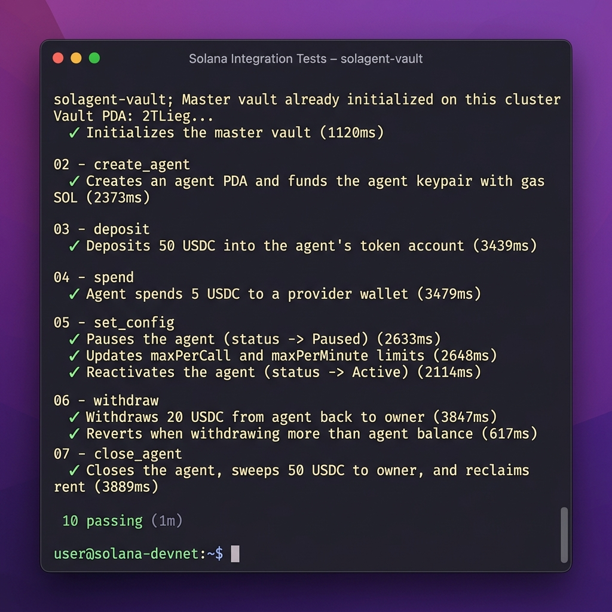

# 🛡️ SolAgent Vault

**Sandboxed spending policies, real-time rate limits, and on-chain budgets for autonomous AI Agents on Solana.**

Built with **Anchor 1.0.2**, **Token-2022 compatibility**, and designed natively for the **HTTP 402 Payment Required** agentic micro-payment standard.

---

## 🚀 The Core Paradigm Shift

Traditional AI Agents are treated like humans from 2010—forced to use shared corporate credit cards, centralized SaaS portals, or vulnerable pre-funded API keys. If the agent's environment is compromised, the developer's entire capital pool is drained instantly.

**SolAgent Vault** introduces the concept of **On-Chain Sandboxed Budgets**:
1.  **Double-Isolated PDA Vaults:** USDC is deposited into an Associated Token Account (ATA) owned by an `AgentState` Program Derived Address (PDA). Only our Anchor program can release these funds.
2.  **Throwaway Hot-Keys:** The AI Agent is equipped with a local keypair (`agent_signer`) holding almost 0 funds (just a tiny SOL gas allocation).
3.  **On-Chain Policy Guards:** Before a single transaction is signed, the smart contract verifies 5 strict, real-time safety limits on the blockchain.

---

## 🛠️ The 5 Security Guardrails (On-Chain)

Every `spend` call executes these strict checks sequentially inside the smart contract:

1.  **Active Status:** Instantly halts all transactions if the developer pauses the agent.
2.  **Target Allowlist:** Restricts payments only to pre-approved API provider wallets (empty allowlist = open access).
3.  **Single-Call Cap:** Enforces a maximum spend limit per individual request.
4.  **Rolling Per-Minute Rate Limit:** Uses a sliding time-window on-chain to restrict spending velocity, preventing infinite prompt-injection loops.
5.  **USDC Balance Verification:** Ensures the sandboxed vault has enough USDC to execute.

---

## 🔌 LLM Integration Skill (`SKILL.md`)

We have designed a native **`SKILL.md`** file that acts as the cognitive instruction manual for LLMs (like Qwen on Ollama or GPT-4o). The AI agent ingests this markdown file to automatically:
*   Understand its smart contract capabilities.
*   Access JSON schemas for tool-calling.
*   Implement the **HTTP 402 Intercept Protocol** (intercepting paywalls, executing Solana payments, and retrying).

---

## 📦 Directory Structure

```text
├── programs/solagent-vault/src/  # On-Chain Smart Contract Layer (Rust)
│   ├── instructions/             # Decoupled semantic instructions
│   ├── errors.rs                 # Custom VaultError codes
│   ├── state.rs                  # PDA data schemas (VaultState, AgentState)
│   └── lib.rs                    # Program declaration & modular entrypoints
├── app/                          # Next.js 15+ & React 19 Frontend Dashboard DApp
├── scripts/                      # Off-chain TS AI Agent Interceptor Simulator
├── tests/                        # Comprehensive TS integration test suite
├── SKILL.md                      # LLM-readable system instructions & tool schemas
└── Anchor.toml                   # Workspace & Program ID configurations
```

---

## 🚀 Quick Start Guide

### 1. Install Dependencies
```bash
yarn install
# and install frontend dependencies
cd app && npm install && cd ..
```

### 2. Compile & Build the Program
```bash
anchor build
```

### 3. Run the On-Chain Test Suite
Run the 10 integration tests against the configured local or devnet provider:
```bash
anchor test
```

### 4. Execute the AI Agent Simulation
Run the live off-chain simulator demonstrating an LLM intercepting an HTTP 402 paywall and executing a spend under the guardrails:
```bash
yarn simulate
```

### 5. Launch the Dashboard UI Console
Start the Next.js developer console:
```bash
cd app
npm run dev
```
Open [http://localhost:3000](http://localhost:3000) to view your real-time visual control panel!

---

## 🌐 Live Deployments
*   **Solana Devnet Program ID:** `C5pqn3tYpivcZiQUhSbXeozSxZQ35P9e7VQTWzvRxr7o`

## 📊 Devnet Tests Verification
Below is the verification of the complete 10-test suite passing successfully on Solana Devnet:


