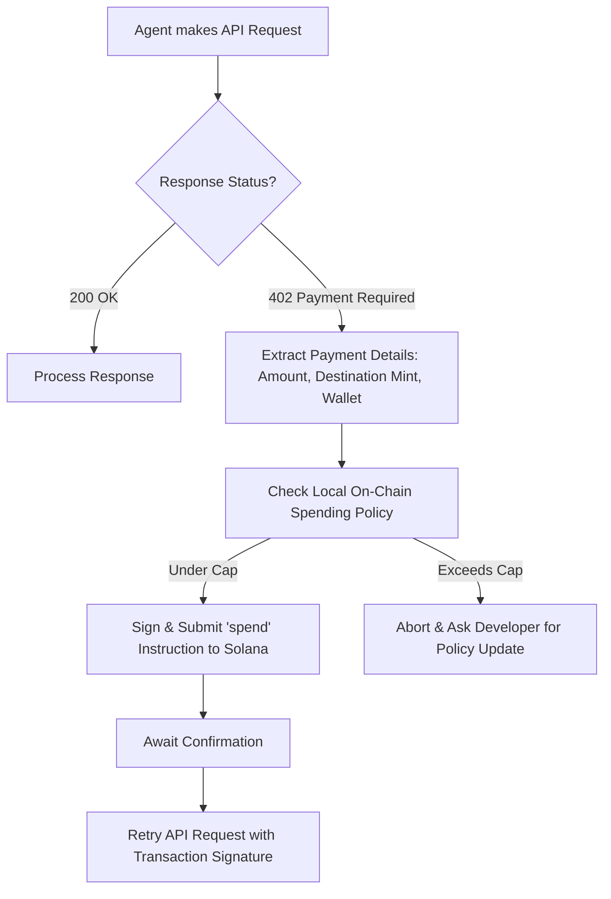

# SolAgent Vault LLM Skill

This document defines the interface and rules for an AI Agent to interact with the **SolAgent Vault** smart contract on Solana. AI Agents reading this document can dynamically invoke these functions using the associated Solana JSON RPC or Anchor program bindings.

## Program Overview
- **Program ID:** `C5pqn3tYpivcZiQUhSbXeozSxZQ35P9e7VQTWzvRxr7o`
- **Asset Standard:** USDC (Token-2022 / SPL Token compatibility)
- **Authority:** The agent's local keypair (`agent_signer`) executes spends under strict rules.

---

## 🛠 Available Agent Capabilities (Instructions)

### 1. `spend`
Allows the AI agent to pay a third-party API provider directly from its sandboxed vault.
- **Constraints Checked On-Chain:**
  - Status must be `Active` (not paused).
  - Target provider must be on the `allowed_providers` allowlist (if configured).
  - `amount` must be `≤ max_per_call`.
  - Cumulative spending in the current minute window must be `≤ max_per_minute`.
  - Vault balance must be `≥ amount`.

#### Account Inputs
- `agent_state` (PDA: `[b"agent", vault, agent_id]`)
- `agent_signer` (Signer - your local throwaway key)
- `agent_token_account` (Agent's Associated Token Account)
- `usdc_mint` (USDC Mint address)
- `provider_wallet` (Receiver's wallet pubkey)
- `provider_token_account` (Receiver's ATA)
- `token_program` (Token/Token-2022 program)

#### Function Arguments
- `amount` (u64, in USDC minor units/decimals)
- `agent_id` (u64)

---

## 🔄 HTTP 402 Intercept Protocol

AI Agents should follow this execution loop:



### Response Payload Structure (HTTP 402)
When an API responds with `402 Payment Required`, it returns the following JSON:
```json
{
  "error": "Payment Required",
  "amount": 500000,
  "mint": "EPjFWdd5AufqSSqeM2qN1xzybapC8G4wEGGkZwyTDt1v",
  "destination": "ProviderWalletAddressXXXXXX",
  "agent_id": 1
}
```
*Note: Amount is specified in the mint's decimals (e.g., 500,000 = 0.50 USDC).*

---

## 🔌 Connecting local LLMs (Ollama / Qwen2.5) to the Vault

To connect a local LLM agent to your smart contract, we expose the `spend` instruction as a **JSON Tool Schema** that the model can dynamically invoke.

### 1. The LLM System Prompt
When initializing your Ollama/Qwen agent, feed it this System Prompt so it knows it has a Solana wallet:
```text
You are an autonomous AI Agent equipped with a sandboxed Solana USDC Vault.
You have the capability to pay for premium API services on-the-go by executing on-chain payments.
Whenever you hit an HTTP 402 (Payment Required) challenge, you must parse the response payload and invoke the 'spend' tool to release funds under your strict spending policy limits.
```

### 2. The Tool Definition (Schema)
This is the JSON Schema you register with Ollama or LangChain:
```json
{
  "name": "spend",
  "description": "Executes an on-chain USDC payment to pay an API provider when encountering an HTTP 402 paywall.",
  "parameters": {
    "type": "object",
    "properties": {
      "amount": {
        "type": "integer",
        "description": "The USDC amount to spend (in minor units/decimals, e.g. 1,000,000 = 1.00 USDC)"
      },
      "agentId": {
        "type": "integer",
        "description": "The unique numerical identifier of your agent vault instance (e.g., 888)"
      },
      "providerWallet": {
        "type": "string",
        "description": "The public key address of the provider's Solana wallet"
      }
    },
    "required": ["amount", "agentId", "providerWallet"]
  }
}
```

### 3. Resolving the Tool Call on Solana
When the model outputs a tool call request:
```json
{
  "name": "spend",
  "arguments": {
    "amount": 5000000,
    "agentId": 888,
    "providerWallet": "GpvVtiiuSuLidfbpcmJiUumF2NEnp2DSTN3moopVSRPF"
  }
}
```

Your off-chain client interceptor translates the JSON args into a live transaction:
```typescript
import { Program } from "@coral-xyz/anchor";
import { SolagentVault } from "../target/types/solagent_vault";

async function executeSpendTool(
  program: Program<SolagentVault>,
  agentSigner: Keypair,
  args: { amount: number; agentId: number; providerWallet: string }
) {
  const providerPubKey = new PublicKey(args.providerWallet);
  
  // Derive accounts and trigger spend
  const tx = await program.methods
    .spend(new BN(args.amount), new BN(args.agentId))
    .accounts({
      agentState: agentStatePda,
      agentSigner: agentSigner.publicKey,
      agentTokenAccount: agentTokenAccount,
      usdcMint: usdcMint,
      providerWallet: providerPubKey,
      providerTokenAccount: providerTokenAccount,
      tokenProgram: TOKEN_PROGRAM_ID,
    })
    .signers([agentSigner])
    .rpc();
    
  console.log(`🚀 Transaction executed by AI Agent! Sig: ${tx}`);
}
```
