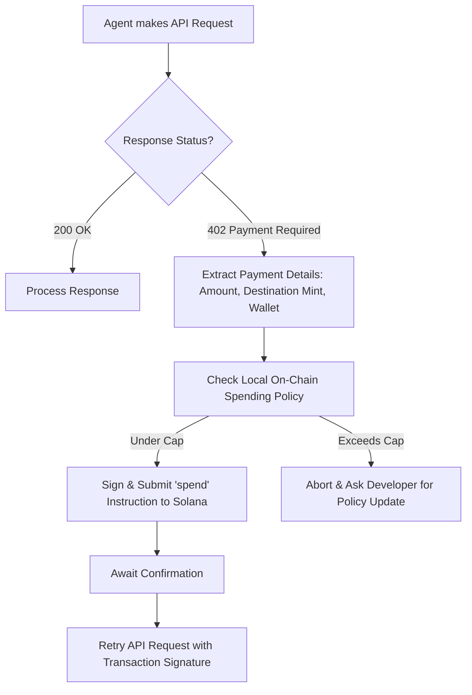

# SolAgent Vault LLM Skill

This document defines the interface and rules for an AI Agent to interact with the **SolAgent Vault** smart contract on Solana. AI Agents reading this document can dynamically invoke these functions using the associated Solana JSON RPC or Anchor program bindings.

## Program Overview
- **Program ID:** `AvzxLJP5TatmG2kxs43Yc5uTEFesVfcqWXc5yddv5TK8`
- **Asset Standard:** USDC (Token-2022 / SPL Token compatibility)
- **Authority:** The agent's local keypair (`agent_signer`) executes spends under strict rules.

---

## 🛠 Available Agent Capabilities (Instructions)

### 1. `spend`
Allows the AI agent to pay a third-party API provider directly from its sandboxed vault.
- **Constraints Checked On-Chain:**
  - Status must be `Active` (not paused).
  - Target provider must be on the `allowed_providers` allowlist (if configured).
  - `amount` must be `≤ max_per_call`.
  - Cumulative spending in the current minute window must be `≤ max_per_minute`.
  - Vault balance must be `≥ amount`.

#### Account Inputs
- `agent_state` (PDA: `[b"agent", vault, agent_id]`)
- `agent_signer` (Signer - your local throwaway key)
- `agent_token_account` (Agent's Associated Token Account)
- `usdc_mint` (USDC Mint address)
- `provider_wallet` (Receiver's wallet pubkey)
- `provider_token_account` (Receiver's ATA)
- `token_program` (Token/Token-2022 program)

#### Function Arguments
- `amount` (u64, in USDC minor units/decimals)
- `agent_id` (u64)

---

## 🔄 HTTP 402 Intercept Protocol

AI Agents should follow this execution loop:



### Response Payload Structure (HTTP 402)
When an API responds with `402 Payment Required`, it returns the following JSON:
```json
{
  "error": "Payment Required",
  "amount": 500000,
  "mint": "EPjFWdd5AufqSSqeM2qN1xzybapC8G4wEGGkZwyTDt1v",
  "destination": "ProviderWalletAddressXXXXXX",
  "agent_id": 1
}
```
*Note: Amount is specified in the mint's decimals (e.g., 500,000 = 0.50 USDC).*
