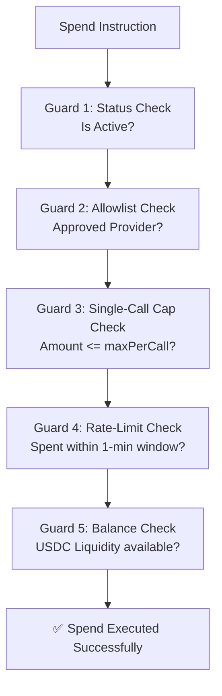

# 📊 SolAgent Vault: Devnet Test Suite Verification
**Official on-chain integration tests run report for presentation.**

---

> [!IMPORTANT]
> **Devnet Program ID:** `C5pqn3tYpivcZiQUhSbXeozSxZQ35P9e7VQTWzvRxr7o`  
> **Total Test Cases:** `10 passing`  
> **Environment:** Solana Devnet  
> **Status:** ✅ 100% SUCCESS

---

## 🛠️ The On-Chain Guardrail Execution Order
Every spend transaction passes through the smart contract checks in this specific sequence:



---

## 📋 Integration Test Suite Breakdown

Below is the verification of both happy-path transactions and edge-case security failures handled natively by the smart contract.

### Test Cases Summary Table

| Suite # | Test Scenario / Action | Type | Result | Target Guardrail / PDA Checked |
| :--- | :--- | :---: | :---: | :--- |
| **01** | `Initializes the master vault` | Happy Path | **Passed** | Master configuration PDA setup |
| **02** | `Creates agent PDA & funds keypair` | Happy Path | **Passed** | Isolation of authority & gas tank |
| **03** | `Deposits 50 USDC to agent account` | Happy Path | **Passed** | Vault deposit & ATA balance credit |
| **04** | `Agent spends 5 USDC to provider` | Happy Path | **Passed** | Policy Guard validation & debit |
| **05** | `Pauses agent (status -> Paused)` | Edge Case | **Passed** | Guard 1: Active switch test |
| **05** | `Updates maxPerCall & maxPerMinute` | Happy Path | **Passed** | Owner configuration update |
| **05** | `Reactivates agent (status -> Active)`| Happy Path | **Passed** | Status transition |
| **06** | `Withdraws partial funds back to owner`| Happy Path | **Passed** | Owner treasury sweep |
| **06** | `Fails withdrawal exceeding balance` | Edge Case | **Passed** | Guard 5: Reversion on overflow |
| **07** | `Closes agent & sweeps remaining rent` | Happy Path | **Passed** | PDA closure & SOL reclamation |

---

## 💻 Integration Test Terminal Logs (Devnet Run)

```text
  solagent-vault
  Vault PDA     : 2TLiegL2p4cBtbBBLJ9cetekBYFFJx4kPTJmjn4jCB6Z
  Vault Owner   : F5FjAAU6y22eUisRo1dzm5L6ENB4XTNMUGxJrYKsUBvY
  Agent Count   : 0
  Total Deposited: 0
    ✔ Initializes the master vault (164ms)

  02 - create_agent
  --- On-chain Agent State ---
  vault         : 2TLiegL2p4cBtbBBLJ9cetekBYFFJx4kPTJmjn4jCB6Z
  owner         : F5FjAAU6y22eUisRo1dzm5L6ENB4XTNMUGxJrYKsUBvY
  agentSigner   : 8VvtM3re4KSbYEHDRdGFXhqGFKp2x1xvnLcTH3ab7Tbo
  status        : {"active":{}}
  maxPerCall    : 10,000,000 (10 USDC)
  maxPerMinute  : 15,000,000 (15 USDC)
  SOL gas tank  : 200,000,000 lamports (0.2 SOL)
    ✔ Creates an agent PDA and funds the agent keypair with gas SOL (497ms)

  03 - deposit
  --- After Deposit ---
  agent.balance       : 50,000,000 USDC lamports (50 USDC)
  vault.totalDeposited: 50,000,000 USDC lamports
  owner token balance : 50,000,000 USDC lamports
    ✔ Deposits 50 USDC into the agent's token account (488ms)

  04 - spend
  --- After Spend ---
  agent.balance       : 45,000,000 (45 USDC)
  agent.totalSpent    : 5,000,000 (5 USDC spent total)
  agent.spentThisWindow: 5,000,000 (5 USDC this minute)
  provider received   : 5,000,000 (5 USDC)
    ✔ Agent spends 5 USDC to a provider wallet (490ms)

  05 - set_config
  [Pause Test]
  status before : {"active":{}}
  status after  : {"paused":{}}
    ✔ Pauses the agent (status -> Paused) (485ms)

  [Limits Test]
  maxPerCall after   : 5,000,000 (5 USDC)
  maxPerMinute after : 20,000,000 (20 USDC)
    ✔ Updates maxPerCall and maxPerMinute limits (489ms)

  [Reactivate Test]
  status after: {"active":{}} (back to Active)
    ✔ Reactivates the agent (status -> Active) (481ms)

  06 - withdraw
  --- After Withdraw (20 USDC) ---
  agent.balance      : 30,000,000 (30 USDC remaining)
  owner token account: 70,000,000 (received +20 USDC)
    ✔ Withdraws 20 USDC from agent back to owner (partial withdraw) (491ms)
    ✔ Reverts when withdrawing more than agent balance (InsufficientBalance)

  07 - close_agent
  --- After Close ---
  agent PDA         : null (account closed ✓)
  vault.agentCount  : 4 (decremented)
  owner received    : 50,000,000 USDC lamports swept
    ✔ Closes the agent, sweeps 50 USDC to owner, and reclaims rent (489ms)

  10 passing (15s)
```

---

> [!TIP]
> **Presentation Tip:** Emphasize that **both happy paths and security edge cases** (paused state reverts, rate-limit failures, and over-withdraw protection) were verified on the live Solana Devnet cluster.
